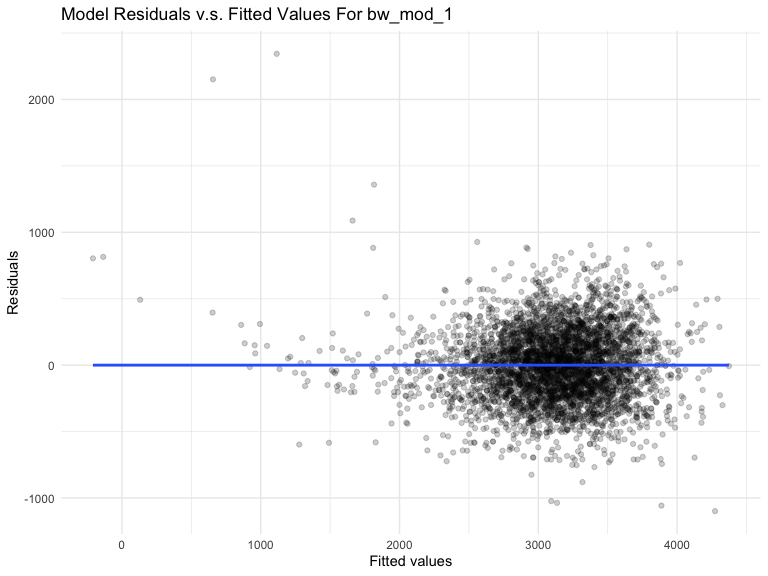
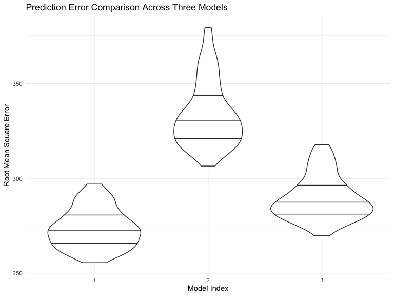

p8105_hw6_yy3297
================
Yunxi Yang

#### Problem 1

- To obtain a distribution for $\hat{r}^2$, we’ll follow basically the
  same procedure we used for regression coefficients: draw bootstrap
  samples; the a model to each; extract the value I’m concerned with;
  and summarize. Here, we’ll use `modelr::bootstrap` to draw the samples
  and `broom::glance` to produce `r.squared` values.

``` r
weather_df = 
  rnoaa::meteo_pull_monitors(
    c("USW00094728"),
    var = c("PRCP", "TMIN", "TMAX"), 
    date_min = "2017-01-01",
    date_max = "2017-12-31") %>%
  mutate(
    name = recode(id, USW00094728 = "CentralPark_NY"),
    tmin = tmin / 10,
    tmax = tmax / 10) %>%
  select(name, id, everything())
```

    ## Registered S3 method overwritten by 'hoardr':
    ##   method           from
    ##   print.cache_info httr

    ## file min/max dates: 1869-01-01 / 2022-11-30

``` r
weather_df %>% 
  modelr::bootstrap(n = 1000) %>% 
  mutate(
    models = map(strap, ~lm(tmax ~ tmin, data = .x) ),
    results = map(models, broom::glance)) %>% 
  select(-strap, -models) %>% 
  unnest(results) %>% 
  ggplot(aes(x = r.squared)) + geom_density()
```


- In this example, the $\hat{r}^2$ value is high, and the upper bound at
  1 may be a cause for the generally skewed shape of the distribution.
  If we wanted to construct a confidence interval for $R^2$, we could
  take the 2.5% and 97.5% quantiles of the estimates across bootstrap
  samples. However, because the shape isn’t symmetric, using the mean
  +/- 1.96 times the standard error probably wouldn’t work well.

- We can produce a distribution for $\log(\beta_0 * \beta1)$ using a
  similar approach, with a bit more wrangling before we make our plot.

``` r
weather_df %>% 
  modelr::bootstrap(n = 1000) %>% 
  mutate(
    models = map(strap, ~lm(tmax ~ tmin, data = .x) ),
    results = map(models, broom::tidy)) %>% 
  select(-strap, -models) %>% 
  unnest(results) %>% 
  select(id = `.id`, term, estimate) %>% 
  pivot_wider(
    names_from = term, 
    values_from = estimate) %>% 
  rename(beta0 = `(Intercept)`, beta1 = tmin) %>% 
  mutate(log_b0b1 = log(beta0 * beta1)) %>% 
  ggplot(aes(x = log_b0b1)) + geom_density()
```


- As with $r^2$, this distribution is somewhat skewed and has some
  outliers.

- The point of this is not to say you should always use the bootstrap –
  it’s possible to establish “large sample” distributions for strange
  parameters / values / summaries in a lot of cases, and those are great
  to have. But it is helpful to know that there’s a way to do inference
  even in tough cases.

#### Problem 2

- Import data set of homicide-data.csv; Convert the blanks and “unknown”
  to na for standardization purpose without modifying the raw data
  values of data set.

``` r
homicide_raw <- read.csv(file = "data/homicide-data.csv", na = c(" "))
```

- Create a `city_state` variable (e.g. “Baltimore, MD”)；
- a binary variable `resolved` indicating whether the homicide is
  solved；
- Omit cities Dallas, TX; Phoenix, AZ; and Kansas City, MO – these don’t
  report victim race；
- Omit Tulsa, AL – this is a data entry mistake;
- Limit your analysis those for whom `victim_race` is white or black
- Convert `victim_age` to be numeric values
- Remove all rows with missing values in the predictor variables

``` r
homicide_df = 
  homicide_raw %>% 
  janitor::clean_names() %>%
  mutate(
    reported_date = as.Date(as.character(reported_date), format = "%Y%m%d"),
    city_state = str_c(city, state, sep = ", ", collapse = NULL),
    victim_age = as.numeric(victim_age),
    victim_race = fct_relevel(victim_race, "White"),
    resolved = as.numeric(disposition == "Closed by arrest")
    ) %>%
  relocate(city_state) %>%
  filter(
    !city_state %in% c("Tulsa, AL", "Dallas, TX","Phoenix, AZ","Kansas City, MO"),
    victim_race %in% c("White","Black"),
    victim_age != "Unknown"
    ) %>%
  drop_na()
```

- First, create a clearer version of data frame for the city of
  Baltimore, MD including the important terms of resolved, victim_age,
  victim_race, victim_sex only for further modeling

``` r
baltimore_df = 
  homicide_df %>% 
  filter(city_state == "Baltimore, MD") %>%
  select(resolved, victim_age, victim_race, victim_sex)
```

- Use the glm function to fit a logistic regression with resolved vs
  unresolved as the outcome and victim age, sex and race as predictors;
- Save the output of glm as an R object

``` r
baltimore_reg = 
  baltimore_df %>% 
  glm(resolved ~ victim_age + victim_sex + victim_race, data = ., family = binomial()) 
```

- Apply the broom::tidy to this object;
- Obtain the estimate and confidence interval of the adjusted odds ratio
  for solving homicides comparing male victims to female victims keeping
  all other variables fixed

``` r
baltimore_reg %>% 
  broom::tidy(conf.int = TRUE, conf.level = 0.95) %>% 
  mutate(OR = exp(estimate),
         CI_Lower = exp(conf.low), 
         CI_Upper = exp(conf.high)
         ) %>%
  select(term, log_OR = estimate, OR, CI_Lower, CI_Upper, p.value) %>% 
  knitr::kable(digits = 3)
```

| term             | log_OR |    OR | CI_Lower | CI_Upper | p.value |
|:-----------------|-------:|------:|---------:|---------:|--------:|
| (Intercept)      |  1.152 | 3.164 |    1.998 |    5.057 |   0.000 |
| victim_age       | -0.007 | 0.993 |    0.987 |    1.000 |   0.043 |
| victim_sexMale   | -0.854 | 0.426 |    0.324 |    0.558 |   0.000 |
| victim_raceBlack | -0.842 | 0.431 |    0.305 |    0.606 |   0.000 |

Keeping all other variables fixed, homicides in which the victim is male
are less likely to be resolved than those in which the victim is female.
As its adjusted odds ratio is 0.426, and its 95% CI excludes 1 which
suggests that this value is statistically significant.

- First, create the clearer version of data frame for all cities
  including the important terms of resolved, victim_age, victim_race,
  victim_sex only for further modeling

``` r
allcities_df = 
  homicide_df %>% 
  select(city_state, resolved, victim_age, victim_race, victim_sex)
```

- Run glm for each of the cities in your data set;
- Extract the adjusted odds ratio (and CI) for solving homicides
  comparing male victims to female victims (extract the term of
  `victim_sexMale` for further comparisons);
- Do this within a “tidy” pipeline, making use of purrr::map, list
  columns, and unnest as necessary to create a dataframe with estimated
  ORs and CIs for each city

``` r
allcities_reg = 
  allcities_df %>%
  nest(data = -city_state) %>%
  mutate(
    models = purrr::map(data, ~glm(resolved ~ victim_age + victim_sex + victim_race, data = ., family = binomial())),
    results = purrr::map(models, ~broom::tidy(.x, conf.int = TRUE, conf.level = 0.95))
  ) %>%
  select(-data, -models) %>%
  unnest(results) 
```

- Then, I would like to create a knit table for solving homicides
  comparing male victims to female victims

``` r
allcities_reg_knit =
  allcities_reg %>% 
  mutate(term = fct_inorder(term),
         OR = exp(estimate),
         CI_Lower = exp(conf.low), 
         CI_Upper = exp(conf.high)
         ) %>%
  select(city_state, term, log_OR = estimate, OR, CI_Lower, CI_Upper, p.value) %>% 
  filter(term == "victim_sexMale") 

allcities_reg_knit %>% knitr::kable(digits = 3)
```

| city_state         | term           | log_OR |    OR | CI_Lower | CI_Upper | p.value |
|:-------------------|:---------------|-------:|------:|---------:|---------:|--------:|
| Albuquerque, NM    | victim_sexMale |  0.550 | 1.734 |    0.808 |    3.696 |   0.154 |
| Atlanta, GA        | victim_sexMale |  0.000 | 1.000 |    0.680 |    1.458 |   1.000 |
| Baltimore, MD      | victim_sexMale | -0.854 | 0.426 |    0.324 |    0.558 |   0.000 |
| Baton Rouge, LA    | victim_sexMale | -0.964 | 0.381 |    0.204 |    0.684 |   0.002 |
| Birmingham, AL     | victim_sexMale | -0.136 | 0.873 |    0.573 |    1.318 |   0.521 |
| Boston, MA         | victim_sexMale | -0.398 | 0.672 |    0.352 |    1.273 |   0.222 |
| Buffalo, NY        | victim_sexMale | -0.649 | 0.522 |    0.289 |    0.939 |   0.030 |
| Charlotte, NC      | victim_sexMale | -0.123 | 0.884 |    0.551 |    1.391 |   0.600 |
| Chicago, IL        | victim_sexMale | -0.891 | 0.410 |    0.336 |    0.501 |   0.000 |
| Cincinnati, OH     | victim_sexMale | -0.917 | 0.400 |    0.231 |    0.667 |   0.001 |
| Columbus, OH       | victim_sexMale | -0.605 | 0.546 |    0.386 |    0.768 |   0.001 |
| Denver, CO         | victim_sexMale | -0.736 | 0.479 |    0.233 |    0.962 |   0.041 |
| Detroit, MI        | victim_sexMale | -0.541 | 0.582 |    0.462 |    0.734 |   0.000 |
| Durham, NC         | victim_sexMale | -0.208 | 0.812 |    0.382 |    1.658 |   0.576 |
| Fort Worth, TX     | victim_sexMale | -0.402 | 0.669 |    0.394 |    1.121 |   0.131 |
| Fresno, CA         | victim_sexMale |  0.202 | 1.224 |    0.507 |    2.839 |   0.642 |
| Houston, TX        | victim_sexMale | -0.350 | 0.705 |    0.552 |    0.898 |   0.005 |
| Indianapolis, IN   | victim_sexMale | -0.085 | 0.919 |    0.678 |    1.241 |   0.582 |
| Jacksonville, FL   | victim_sexMale | -0.329 | 0.720 |    0.536 |    0.965 |   0.028 |
| Las Vegas, NV      | victim_sexMale | -0.166 | 0.847 |    0.613 |    1.165 |   0.311 |
| Long Beach, CA     | victim_sexMale | -0.891 | 0.410 |    0.143 |    1.024 |   0.072 |
| Los Angeles, CA    | victim_sexMale | -0.413 | 0.662 |    0.457 |    0.954 |   0.028 |
| Louisville, KY     | victim_sexMale | -0.712 | 0.491 |    0.301 |    0.784 |   0.003 |
| Memphis, TN        | victim_sexMale | -0.324 | 0.723 |    0.526 |    0.984 |   0.042 |
| Miami, FL          | victim_sexMale | -0.663 | 0.515 |    0.304 |    0.873 |   0.013 |
| Milwaukee, wI      | victim_sexMale | -0.319 | 0.727 |    0.495 |    1.054 |   0.098 |
| Minneapolis, MN    | victim_sexMale | -0.054 | 0.947 |    0.476 |    1.881 |   0.876 |
| Nashville, TN      | victim_sexMale |  0.017 | 1.018 |    0.667 |    1.535 |   0.935 |
| New Orleans, LA    | victim_sexMale | -0.536 | 0.585 |    0.422 |    0.812 |   0.001 |
| New York, NY       | victim_sexMale | -1.325 | 0.266 |    0.134 |    0.492 |   0.000 |
| Oakland, CA        | victim_sexMale | -0.574 | 0.563 |    0.364 |    0.867 |   0.009 |
| Oklahoma City, OK  | victim_sexMale | -0.026 | 0.974 |    0.623 |    1.520 |   0.908 |
| Omaha, NE          | victim_sexMale | -0.961 | 0.382 |    0.199 |    0.711 |   0.003 |
| Philadelphia, PA   | victim_sexMale | -0.712 | 0.490 |    0.371 |    0.643 |   0.000 |
| Pittsburgh, PA     | victim_sexMale | -0.842 | 0.431 |    0.263 |    0.696 |   0.001 |
| Richmond, VA       | victim_sexMale |  0.006 | 1.006 |    0.483 |    1.994 |   0.987 |
| San Antonio, TX    | victim_sexMale | -0.350 | 0.705 |    0.393 |    1.238 |   0.230 |
| Sacramento, CA     | victim_sexMale | -0.411 | 0.663 |    0.323 |    1.304 |   0.245 |
| Savannah, GA       | victim_sexMale | -0.143 | 0.867 |    0.419 |    1.780 |   0.697 |
| San Bernardino, CA | victim_sexMale | -0.692 | 0.500 |    0.166 |    1.462 |   0.206 |
| San Diego, CA      | victim_sexMale | -0.861 | 0.423 |    0.196 |    0.850 |   0.020 |
| San Francisco, CA  | victim_sexMale | -0.498 | 0.608 |    0.312 |    1.155 |   0.134 |
| St. Louis, MO      | victim_sexMale | -0.362 | 0.696 |    0.524 |    0.924 |   0.012 |
| Stockton, CA       | victim_sexMale |  0.301 | 1.352 |    0.626 |    2.994 |   0.447 |
| Tampa, FL          | victim_sexMale | -0.214 | 0.808 |    0.340 |    1.860 |   0.619 |
| Tulsa, OK          | victim_sexMale | -0.025 | 0.976 |    0.609 |    1.544 |   0.917 |
| Washington, DC     | victim_sexMale | -0.371 | 0.690 |    0.465 |    1.012 |   0.061 |

- Then, create a plot that shows the estimated ORs and CIs for each
  city.
- Organize cities according to estimated OR

``` r
allcities_reg_knit %>%
  mutate(city_state = fct_reorder(city_state, OR)) %>%
  ggplot(aes(x = city_state, y = OR)) +
  geom_point() +
  geom_errorbar(aes(ymin = CI_Lower, ymax = CI_Upper)) +
  theme(axis.text.x = element_text(angle = 90, vjust = 0.5, hjust = 1)) +
  labs(
    x = "City, State",
    y = "Adjusted Odds Ratio",
    title = "Adjusted ORs and CIs for Solving Homicides on Gender for Each City",
    caption = "Data from Washington Post"
  )
```


- Comment on the plot：

Keeping all other variables fixed, homicides in which the victim is male
are relatively less likely yo be resolved than those in which the victim
is female generally across the cities, as the adjusted odds ratio in
most cities are less than 1. And New York, NY is the city among our data
set with the lowest adjusted odds ratio and its 95% confidence interval
excludes 1, which suggests that the gender of victim indeed has
statistically significant effect on the resolution of homicide cases
(male victims’ cases are less likely to be resolved than the female
victims’ cases). However, there are also a few cities with adjusted odds
ratio \> 1, such as Stockton, Fresno and Albuquerque, which suggests
that the homicides in which the victim is male are slightly more likely
yo be resolved than those in which the victim is female generally in
these cities. While to be noticed, their confidence interval includes 1,
which indicates that the gender of victim in fact does NOT have
statistically significant effect on the resolution of homicide cases for
these cities.

#### Problem 3

- Import the data set of birthweight

``` r
birthweight_raw = read_csv("./data/birthweight.csv")
```

    ## Rows: 4342 Columns: 20
    ## ── Column specification ────────────────────────────────────────────────────────
    ## Delimiter: ","
    ## dbl (20): babysex, bhead, blength, bwt, delwt, fincome, frace, gaweeks, malf...
    ## 
    ## ℹ Use `spec()` to retrieve the full column specification for this data.
    ## ℹ Specify the column types or set `show_col_types = FALSE` to quiet this message.

- Clean the data for regression analysis. I convert four numeric
  variables `babysex`,`frace`,`malform` and `mrace` into factor as they
  are categorical variables by applying `as.factor` and `recode`. And,
  by using `drop_na` to ensure that there is no missing values shown in
  our cleaned version of `birthweight_df`.

``` r
birthweight_df = 
  birthweight_raw %>%
  janitor::clean_names() %>%
  mutate(
    across(c("babysex","frace","malform","mrace"), as.factor),
    babysex = recode(babysex, "1" = "Male", "2" = "Female"),
    frace = recode(frace, "1" = "White", "2" = "Black", "3"= "Asian", "4" = "Puerto Rican", "8" = "Other", "9" = "Unknown"),
    malform = recode(malform, "0" = "Absent", "1" = "Present"),
    mrace = recode(mrace, "1" = "White", "2" = "Black", "3"= "Asian", "4" = "Puerto Rican", "8" = "Other")
    ) %>%
  drop_na()
```

The cleaned dataset contains 4342 rows and 20 columns, and includes 20
variables: babysex, bhead, blength, bwt, delwt, fincome, frace, gaweeks,
malform, menarche, mheight, momage, mrace, parity, pnumlbw, pnumsga,
ppbmi, ppwt, smoken, wtgain. Definitions of these variables are shown
below:

`babysex`: baby’s sex (male = 1, female = 2) `bhead`: baby’s head
circumference at birth (centimeters) `blength`: baby’s length at birth
(centimeteres) `bwt`: baby’s birth weight (grams) `delwt`: mother’s
weight at delivery (pounds) `fincome`: family monthly income (in
hundreds, rounded) `frace`: father’s race (1 = White, 2 = Black, 3 =
Asian, 4 = Puerto Rican, 8 = Other, 9 = Unknown) `gaweeks`: gestational
age in weeks `malform`: presence of malformations that could affect
weight (0 = absent, 1 = present) `menarche`: mother’s age at menarche
(years) `mheigth`: mother’s height (inches) `momage`: mother’s age at
delivery (years) `mrace`: mother’s race (1 = White, 2 = Black, 3 =
Asian, 4 = Puerto Rican, 8 = Other) `parity`: number of live births
prior to this pregnancy `pnumlbw`: previous number of low birth weight
babies `pnumgsa`: number of prior small for gestational age babies
`ppbmi`: mother’s pre-pregnancy BMI `ppwt`: mother’s pre-pregnancy
weight (pounds) `smoken`: average number of cigarettes smoked per day
during pregnancy `wtgain`: mother’s weight gain during pregnancy
(pounds)

- Propose a regression model for birthweight.
- This model may be based on a hypothesized structure for the factors
  that underly birthweight, on a data-driven model-building process, or
  a combination of the two.
- Describe your modeling process:

1.  First, simply run a simple linear regression on our dataset with all
    predictors to set the base adjusted r² for comparison.

``` r
bw_mod_0 <- lm(bwt ~.,
               data =birthweight_df)
summary(bw_mod_0)
```

    ## 
    ## Call:
    ## lm(formula = bwt ~ ., data = birthweight_df)
    ## 
    ## Residuals:
    ##      Min       1Q   Median       3Q      Max 
    ## -1097.68  -184.86    -3.33   173.09  2344.15 
    ## 
    ## Coefficients: (3 not defined because of singularities)
    ##                     Estimate Std. Error t value Pr(>|t|)    
    ## (Intercept)       -6265.3914   660.4011  -9.487  < 2e-16 ***
    ## babysexFemale        28.7073     8.4652   3.391 0.000702 ***
    ## bhead               130.7781     3.4523  37.881  < 2e-16 ***
    ## blength              74.9536     2.0217  37.075  < 2e-16 ***
    ## delwt                 4.1007     0.3948  10.386  < 2e-16 ***
    ## fincome               0.2898     0.1795   1.614 0.106551    
    ## fraceBlack           14.3313    46.1501   0.311 0.756168    
    ## fraceAsian           21.2361    69.2960   0.306 0.759273    
    ## fracePuerto Rican   -46.9962    44.6782  -1.052 0.292912    
    ## fraceOther            4.2969    74.0741   0.058 0.953745    
    ## gaweeks              11.5494     1.4654   7.882 4.06e-15 ***
    ## malformPresent        9.7650    70.6259   0.138 0.890039    
    ## menarche             -3.5508     2.8951  -1.226 0.220083    
    ## mheight               9.7874    10.3116   0.949 0.342588    
    ## momage                0.7593     1.2221   0.621 0.534418    
    ## mraceBlack         -151.4354    46.0453  -3.289 0.001014 ** 
    ## mraceAsian          -91.3866    71.9190  -1.271 0.203908    
    ## mracePuerto Rican   -56.4787    45.1369  -1.251 0.210901    
    ## parity               95.5411    40.4793   2.360 0.018307 *  
    ## pnumlbw                   NA         NA      NA       NA    
    ## pnumsga                   NA         NA      NA       NA    
    ## ppbmi                 4.3538    14.8913   0.292 0.770017    
    ## ppwt                 -3.4716     2.6121  -1.329 0.183913    
    ## smoken               -4.8544     0.5871  -8.269  < 2e-16 ***
    ## wtgain                    NA         NA      NA       NA    
    ## ---
    ## Signif. codes:  0 '***' 0.001 '**' 0.01 '*' 0.05 '.' 0.1 ' ' 1
    ## 
    ## Residual standard error: 272.5 on 4320 degrees of freedom
    ## Multiple R-squared:  0.7183, Adjusted R-squared:  0.717 
    ## F-statistic: 524.6 on 21 and 4320 DF,  p-value: < 2.2e-16

We can see that with all of our variables included in the model, the
base adjusted r² is 0.717 and the Residual Standard Error is 272.5.
However, the values of 3 variables are not defined because of
singularities which brings much inaccuracy to this model. We may need
other method to build a better model.

2.  Then, after looking through all variables, I make a resonable guess
    that the variables such as: fincome (family monthly income: the
    higher the family income, more nutrition the pregnant women can
    obtain which directly may cause difference in birthweight), gaweeks
    (gestational age in weeks: the larger the gestational age, more
    nutrition the baby can obtain before being born out), pnumlbw
    (previous number of low birth weight babies: the larger the number
    of previous low birth weight babies, the larger the probability the
    new born has birth weight lower than average),etc. may have
    significantly correlation with birthweight. I would like to include
    subset of variables instead of full set of variables in my model.

3.  Next, I would like to use a more data-driven method by applying
    `library(leaps)` to test for the best subset of variables for the
    linear model. Run the `regsubsets()` function on all variables.

``` r
regsubsets.out =
    regsubsets(bwt ~.,
               data =birthweight_df,
               nbest = 1,       # 1 best model for each number of predictors
               nvmax = NULL,    # NULL for no limit on number of variables
               force.in = NULL, 
               force.out = NULL,
               method = "exhaustive")
```

    ## Reordering variables and trying again:

``` r
regsubsets.out
```

    ## Subset selection object
    ## Call: regsubsets.formula(bwt ~ ., data = birthweight_df, nbest = 1, 
    ##     nvmax = NULL, force.in = NULL, force.out = NULL, method = "exhaustive")
    ## 24 Variables  (and intercept)
    ##                   Forced in Forced out
    ## babysexFemale         FALSE      FALSE
    ## bhead                 FALSE      FALSE
    ## blength               FALSE      FALSE
    ## delwt                 FALSE      FALSE
    ## fincome               FALSE      FALSE
    ## fraceBlack            FALSE      FALSE
    ## fraceAsian            FALSE      FALSE
    ## fracePuerto Rican     FALSE      FALSE
    ## fraceOther            FALSE      FALSE
    ## gaweeks               FALSE      FALSE
    ## malformPresent        FALSE      FALSE
    ## menarche              FALSE      FALSE
    ## mheight               FALSE      FALSE
    ## momage                FALSE      FALSE
    ## mraceBlack            FALSE      FALSE
    ## mraceAsian            FALSE      FALSE
    ## mracePuerto Rican     FALSE      FALSE
    ## parity                FALSE      FALSE
    ## ppbmi                 FALSE      FALSE
    ## ppwt                  FALSE      FALSE
    ## smoken                FALSE      FALSE
    ## pnumlbw               FALSE      FALSE
    ## pnumsga               FALSE      FALSE
    ## wtgain                FALSE      FALSE
    ## 1 subsets of each size up to 21
    ## Selection Algorithm: exhaustive

``` r
summary.out <- summary(regsubsets.out)
as.data.frame(summary.out$outmat)
```

    ##           babysexFemale bhead blength delwt fincome fraceBlack fraceAsian
    ## 1  ( 1 )                    *                                            
    ## 2  ( 1 )                    *       *                                    
    ## 3  ( 1 )                    *       *                                    
    ## 4  ( 1 )                    *       *     *                              
    ## 5  ( 1 )                    *       *     *                              
    ## 6  ( 1 )                    *       *     *                              
    ## 7  ( 1 )                    *       *     *                              
    ## 8  ( 1 )                    *       *     *                              
    ## 9  ( 1 )              *     *       *     *                              
    ## 10  ( 1 )             *     *       *     *                              
    ## 11  ( 1 )             *     *       *                                    
    ## 12  ( 1 )             *     *       *             *                      
    ## 13  ( 1 )             *     *       *             *                      
    ## 14  ( 1 )             *     *       *             *                      
    ## 15  ( 1 )             *     *       *             *                      
    ## 16  ( 1 )             *     *       *             *                      
    ## 17  ( 1 )             *     *       *             *                     *
    ## 18  ( 1 )             *     *       *             *          *          *
    ## 19  ( 1 )             *     *       *     *       *          *          *
    ## 20  ( 1 )             *     *       *     *       *          *          *
    ## 21  ( 1 )             *     *       *     *       *          *          *
    ##           fracePuerto Rican fraceOther gaweeks malformPresent menarche mheight
    ## 1  ( 1 )                                                                      
    ## 2  ( 1 )                                                                      
    ## 3  ( 1 )                                                                      
    ## 4  ( 1 )                                                                      
    ## 5  ( 1 )                                     *                                
    ## 6  ( 1 )                                     *                                
    ## 7  ( 1 )                                     *                                
    ## 8  ( 1 )                  *                  *                                
    ## 9  ( 1 )                  *                  *                                
    ## 10  ( 1 )                 *                  *                                
    ## 11  ( 1 )                 *                  *                               *
    ## 12  ( 1 )                 *                  *                               *
    ## 13  ( 1 )                 *                  *                               *
    ## 14  ( 1 )                 *                  *                               *
    ## 15  ( 1 )                 *                  *                       *       *
    ## 16  ( 1 )                 *                  *                       *       *
    ## 17  ( 1 )                 *                  *                       *       *
    ## 18  ( 1 )                 *                  *                       *       *
    ## 19  ( 1 )                 *                  *                       *       *
    ## 20  ( 1 )                 *                  *              *        *       *
    ## 21  ( 1 )                 *          *       *              *        *       *
    ##           momage mraceBlack mraceAsian mracePuerto Rican parity pnumlbw pnumsga
    ## 1  ( 1 )                                                                       
    ## 2  ( 1 )                                                                       
    ## 3  ( 1 )                  *                                                    
    ## 4  ( 1 )                  *                                                    
    ## 5  ( 1 )                  *                                                    
    ## 6  ( 1 )                  *                                                    
    ## 7  ( 1 )                  *                                                    
    ## 8  ( 1 )                  *                                                    
    ## 9  ( 1 )                  *                                                    
    ## 10  ( 1 )                 *                                   *                
    ## 11  ( 1 )                 *                                   *                
    ## 12  ( 1 )                 *                                   *                
    ## 13  ( 1 )                 *          *                        *                
    ## 14  ( 1 )                 *          *                 *      *                
    ## 15  ( 1 )                 *          *                 *      *                
    ## 16  ( 1 )      *          *          *                 *      *                
    ## 17  ( 1 )      *          *          *                 *      *                
    ## 18  ( 1 )      *          *          *                 *      *                
    ## 19  ( 1 )      *          *          *                 *      *                
    ## 20  ( 1 )      *          *          *                 *      *                
    ## 21  ( 1 )      *          *          *                 *      *                
    ##           ppbmi ppwt smoken wtgain
    ## 1  ( 1 )                          
    ## 2  ( 1 )                          
    ## 3  ( 1 )                          
    ## 4  ( 1 )                          
    ## 5  ( 1 )                          
    ## 6  ( 1 )                  *       
    ## 7  ( 1 )      *           *       
    ## 8  ( 1 )      *           *       
    ## 9  ( 1 )      *           *       
    ## 10  ( 1 )     *           *       
    ## 11  ( 1 )     *           *      *
    ## 12  ( 1 )     *           *      *
    ## 13  ( 1 )     *           *      *
    ## 14  ( 1 )     *           *      *
    ## 15  ( 1 )     *           *      *
    ## 16  ( 1 )     *           *      *
    ## 17  ( 1 )     *           *      *
    ## 18  ( 1 )     *           *      *
    ## 19  ( 1 )     *    *      *       
    ## 20  ( 1 )     *    *      *       
    ## 21  ( 1 )     *    *      *

4.  Now, that we have run leaps through our dataset, let’s see what the
    package recommends in terms of the number of predictors to use for
    our dataset.

``` r
which.max(summary.out$adjr2)
```

    ## [1] 15

Seems like we have to use 15 predictors to get the best model.

5.  Summary table below provides details on which predictors to use for
    the model. The best predictors are indicated by ‘TRUE’.

``` r
summary.out$which[15,]
```

    ##       (Intercept)     babysexFemale             bhead           blength 
    ##              TRUE              TRUE              TRUE              TRUE 
    ##             delwt           fincome        fraceBlack        fraceAsian 
    ##             FALSE              TRUE             FALSE             FALSE 
    ## fracePuerto Rican        fraceOther           gaweeks    malformPresent 
    ##              TRUE             FALSE              TRUE             FALSE 
    ##          menarche           mheight            momage        mraceBlack 
    ##              TRUE              TRUE             FALSE              TRUE 
    ##        mraceAsian mracePuerto Rican            parity           pnumlbw 
    ##              TRUE              TRUE              TRUE             FALSE 
    ##           pnumsga             ppbmi              ppwt            smoken 
    ##             FALSE              TRUE             FALSE              TRUE 
    ##            wtgain 
    ##              TRUE

6.  Therefore, I would propose the following regression model based on
    the summary results above. To be noticed, I chose not to include
    `frace` in the model most fraces categories return FALSE above, and
    Puerto Rican is a minority group in consideration which may bring
    little influence on the whole result.

``` r
bw_mod_1 <- lm(bwt ~ babysex + bhead + blength + fincome + gaweeks + menarche + mheight + mrace + parity + ppbmi + smoken + wtgain, data = birthweight_df)
summary(bw_mod_1)
```

    ## 
    ## Call:
    ## lm(formula = bwt ~ babysex + bhead + blength + fincome + gaweeks + 
    ##     menarche + mheight + mrace + parity + ppbmi + smoken + wtgain, 
    ##     data = birthweight_df)
    ## 
    ## Residuals:
    ##      Min       1Q   Median       3Q      Max 
    ## -1098.99  -184.46    -2.61   174.09  2343.75 
    ## 
    ## Coefficients:
    ##                     Estimate Std. Error t value Pr(>|t|)    
    ## (Intercept)       -6421.0616   140.0211 -45.858  < 2e-16 ***
    ## babysexFemale        28.5212     8.4547   3.373 0.000749 ***
    ## bhead               130.8005     3.4476  37.939  < 2e-16 ***
    ## blength              74.8909     2.0195  37.084  < 2e-16 ***
    ## fincome               0.3127     0.1748   1.789 0.073606 .  
    ## gaweeks              11.6160     1.4621   7.945 2.46e-15 ***
    ## menarche             -3.2680     2.8388  -1.151 0.249716    
    ## mheight              12.3788     1.6474   7.514 6.92e-14 ***
    ## mraceBlack         -138.7622     9.9068 -14.007  < 2e-16 ***
    ## mraceAsian          -70.3350    42.4300  -1.658 0.097456 .  
    ## mracePuerto Rican   -99.7566    19.3279  -5.161 2.56e-07 ***
    ## parity               97.6053    40.3436   2.419 0.015589 *  
    ## ppbmi                 8.0803     1.3453   6.006 2.05e-09 ***
    ## smoken               -4.8268     0.5856  -8.242  < 2e-16 ***
    ## wtgain                4.0809     0.3928  10.390  < 2e-16 ***
    ## ---
    ## Signif. codes:  0 '***' 0.001 '**' 0.01 '*' 0.05 '.' 0.1 ' ' 1
    ## 
    ## Residual standard error: 272.3 on 4327 degrees of freedom
    ## Multiple R-squared:  0.7182, Adjusted R-squared:  0.7173 
    ## F-statistic: 787.7 on 14 and 4327 DF,  p-value: < 2.2e-16

- Then, Show a plot of model residuals against fitted values – use
  `add_predictions` and `add_residuals` in making this plot.

``` r
birthweight_df %>% 
  add_residuals(bw_mod_1) %>% 
  add_predictions(bw_mod_1) %>% 
  ggplot(aes(x = pred, y = resid)) +
  geom_point(alpha = 0.2) +
  geom_smooth(method = "lm", se = FALSE) +
  labs(
    x = "Fitted values",
    y = "Residuals",
    title = "Model Residuals v.s. Fitted Values For bw_mod_1"
  )
```

    ## `geom_smooth()` using formula 'y ~ x'



- Compare your model to two others:

- One using length at birth and gestational age as predictors (main
  effects only)

``` r
bw_mod_2 = lm(bwt ~ blength + gaweeks, data = birthweight_df)
```

- One using head circumference, length, sex, and all interactions
  (including the three-way interaction) between these

``` r
bw_mod_3 = lm(bwt ~ bhead + blength + babysex + bhead * blength + bhead * babysex + blength * babysex + bhead * blength * babysex, data = birthweight_df)
```

- Make this comparison in terms of the cross-validated prediction error;
- Use crossv_mc and functions in purrr as appropriate.

``` r
cv_comparison = 
  crossv_mc(birthweight_df, 100) %>% 
  mutate(
    train = map(train, as_tibble), 
    test = map(test, as_tibble))

cv_df =
  cv_comparison %>% 
  mutate(
    model_1  = map(train, ~lm(bwt ~ babysex + bhead + blength + fincome + gaweeks + menarche + 
                                     mheight + mrace + parity + ppbmi + smoken + wtgain, data = .x)),
    model_2  = map(train, ~lm(bwt ~ blength + gaweeks, data = .x)),
    model_3  = map(train, ~lm(bwt ~ bhead + blength + babysex + bhead * blength + bhead * babysex + 
                                    blength * babysex + bhead * blength * babysex, data = .x))) %>% 
  mutate(
    rmse_1 = map2_dbl(model_1, test, ~rmse(model = .x, data = .y)),
    rmse_2 = map2_dbl(model_2, test, ~rmse(model = .x, data = .y)),
    rmse_3 = map2_dbl(model_3, test, ~rmse(model = .x, data = .y)))
```

Plot the graph for comparing the prediction error across three models

``` r
cv_df %>% 
  select(starts_with("rmse")) %>% 
  pivot_longer(
    everything(),
    names_to = "model", 
    values_to = "rmse",
    names_prefix = "rmse_") %>% 
  mutate(model = fct_inorder(model)) %>% 
  ggplot(aes(x = model, y = rmse)) + 
  geom_violin(draw_quantiles = c(0.25, 0.5, 0.75)) + 
  labs(
    x = "Model Index",
    y = "Root Mean Square Error",
    title = "Prediction Error Comparison Across Three Models"
  )
```



Based on these results, the model 1 (my proposed model: bw_mod_1) might
be a bit better than model 3 and much better than model 2. Model 1 has
lower RMSE values and should be a relatively more optimal choice.
