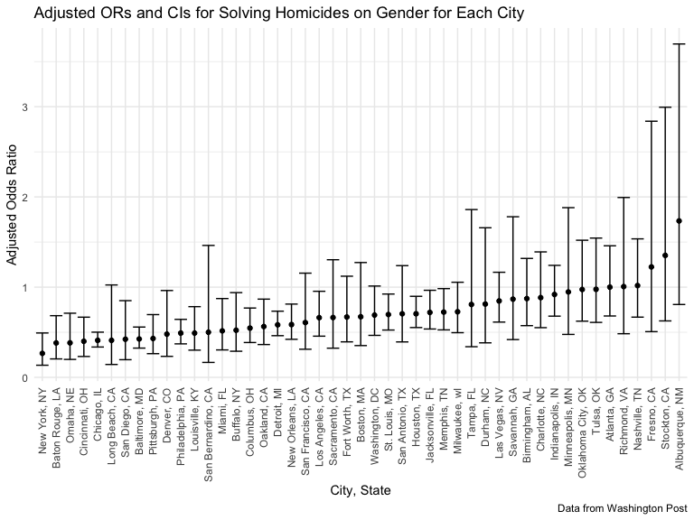

p8105_hw6_yy3297
================
Yunxi Yang

#### Problem 1

- To obtain a distribution for $\hat{r}^2$, we’ll follow basically the
  same procedure we used for regression coefficients: draw bootstrap
  samples; the a model to each; extract the value I’m concerned with;
  and summarize. Here, we’ll use `modelr::bootstrap` to draw the samples
  and `broom::glance` to produce `r.squared` values.

``` r
weather_df = 
  rnoaa::meteo_pull_monitors(
    c("USW00094728"),
    var = c("PRCP", "TMIN", "TMAX"), 
    date_min = "2017-01-01",
    date_max = "2017-12-31") %>%
  mutate(
    name = recode(id, USW00094728 = "CentralPark_NY"),
    tmin = tmin / 10,
    tmax = tmax / 10) %>%
  select(name, id, everything())
```

    ## Registered S3 method overwritten by 'hoardr':
    ##   method           from
    ##   print.cache_info httr

    ## file min/max dates: 1869-01-01 / 2022-11-30

``` r
weather_df %>% 
  modelr::bootstrap(n = 1000) %>% 
  mutate(
    models = map(strap, ~lm(tmax ~ tmin, data = .x) ),
    results = map(models, broom::glance)) %>% 
  select(-strap, -models) %>% 
  unnest(results) %>% 
  ggplot(aes(x = r.squared)) + geom_density()
```


- In this example, the $\hat{r}^2$ value is high, and the upper bound at
  1 may be a cause for the generally skewed shape of the distribution.
  If we wanted to construct a confidence interval for $R^2$, we could
  take the 2.5% and 97.5% quantiles of the estimates across bootstrap
  samples. However, because the shape isn’t symmetric, using the mean
  +/- 1.96 times the standard error probably wouldn’t work well.

- We can produce a distribution for $\log(\beta_0 * \beta1)$ using a
  similar approach, with a bit more wrangling before we make our plot.

``` r
weather_df %>% 
  modelr::bootstrap(n = 1000) %>% 
  mutate(
    models = map(strap, ~lm(tmax ~ tmin, data = .x) ),
    results = map(models, broom::tidy)) %>% 
  select(-strap, -models) %>% 
  unnest(results) %>% 
  select(id = `.id`, term, estimate) %>% 
  pivot_wider(
    names_from = term, 
    values_from = estimate) %>% 
  rename(beta0 = `(Intercept)`, beta1 = tmin) %>% 
  mutate(log_b0b1 = log(beta0 * beta1)) %>% 
  ggplot(aes(x = log_b0b1)) + geom_density()
```


- As with $r^2$, this distribution is somewhat skewed and has some
  outliers.

- The point of this is not to say you should always use the bootstrap –
  it’s possible to establish “large sample” distributions for strange
  parameters / values / summaries in a lot of cases, and those are great
  to have. But it is helpful to know that there’s a way to do inference
  even in tough cases.

#### Problem 2

- Import data set of homicide-data.csv; Convert the blanks and “unknown”
  to na for standardization purpose without modifying the raw data
  values of data set.

``` r
homicide_raw <- read.csv(file = "data/homicide-data.csv", na = c(" ", "Unknown"))
```

- Create a `city_state` variable (e.g. “Baltimore, MD”)；
- a binary variable `resolved` indicating whether the homicide is
  solved；
- Omit cities Dallas, TX; Phoenix, AZ; and Kansas City, MO – these don’t
  report victim race；
- Omit Tulsa, AL – this is a data entry mistake;
- Limit your analysis those for whom `victim_race` is white or black
- Convert `victim_age` to be numeric values

``` r
homicide_df = 
  homicide_raw %>% 
  janitor::clean_names() %>%
  mutate(
    reported_date = as.Date(as.character(reported_date), format = "%Y%m%d"),
    city_state = str_c(city, state, sep = ", ", collapse = NULL),
    victim_age = as.numeric(victim_age),
    victim_race = fct_relevel(victim_race, "White"),
    resolved = as.numeric(disposition == "Closed by arrest")
    ) %>%
  relocate(city_state) %>%
  filter(city_state != c("Tulsa, AL", "Dallas, TX", "Phoenix, AZ", "Kansas City, MO"),
         victim_race == c("White","Black"))
```

- First, create a clearer version of data frame for the city of
  Baltimore, MD including the important terms of resolved, victim_age,
  victim_race, victim_sex only for further modeling

``` r
baltimore_df = 
  homicide_df %>% 
  filter(city_state == "Baltimore, MD") %>%
  select(resolved, victim_age, victim_race, victim_sex)
```

- Use the glm function to fit a logistic regression with resolved vs
  unresolved as the outcome and victim age, sex and race as predictors;
- Save the output of glm as an R object

``` r
baltimore_reg = 
  baltimore_df %>% 
  glm(resolved ~ victim_age + victim_sex + victim_race, data = ., family = binomial()) 
```

- Apply the broom::tidy to this object;
- Obtain the estimate and confidence interval of the adjusted odds ratio
  for solving homicides comparing male victims to female victims keeping
  all other variables fixed

``` r
baltimore_reg %>% 
  broom::tidy(conf.int = TRUE, conf.level = 0.95) %>% 
  mutate(OR = exp(estimate),
         CI_Lower = exp(conf.low), 
         CI_Upper = exp(conf.high)
         ) %>%
  select(term, log_OR = estimate, OR, CI_Lower, CI_Upper, p.value) %>% 
  knitr::kable(digits = 3)
```

| term             | log_OR |    OR | CI_Lower | CI_Upper | p.value |
|:-----------------|-------:|------:|---------:|---------:|--------:|
| (Intercept)      |  1.421 | 4.140 |    2.124 |    8.262 |   0.000 |
| victim_age       | -0.011 | 0.989 |    0.980 |    0.999 |   0.027 |
| victim_sexMale   | -0.940 | 0.391 |    0.265 |    0.572 |   0.000 |
| victim_raceBlack | -0.923 | 0.397 |    0.239 |    0.655 |   0.000 |

Keeping all other variables fixed, homicides in which the victim is male
are significantly less like to be resolved than those in which the
victim is female.

- First, create the clearer version of data frame for all cities
  including the important terms of resolved, victim_age, victim_race,
  victim_sex only for further modeling

``` r
allcities_df = 
  homicide_df %>% 
  select(city_state, resolved, victim_age, victim_race, victim_sex)
```

- Run glm for each of the cities in your data set;
- Extract the adjusted odds ratio (and CI) for solving homicides
  comparing male victims to female victims (extract the term of
  `victim_sexMale` for further comparisons);
- Do this within a “tidy” pipeline, making use of purrr::map, list
  columns, and unnest as necessary to create a dataframe with estimated
  ORs and CIs for each city

``` r
allcities_reg = 
  allcities_df %>%
  nest(data = -city_state) %>%
  mutate(
    models = purrr::map(data, ~glm(resolved ~ victim_age + victim_sex + victim_race, data = ., family = binomial())),
    results = purrr::map(models, ~broom::tidy(.x, conf.int = TRUE, conf.level = 0.95))
  ) %>%
  select(-data, -models) %>%
  unnest(results) 
```

- Then, I would like to create a knit table for solving homicides
  comparing male victims to female victims

``` r
allcities_reg_knit =
  allcities_reg %>% 
  mutate(term = fct_inorder(term),
         OR = exp(estimate),
         CI_Lower = exp(conf.low), 
         CI_Upper = exp(conf.high)
         ) %>%
  select(city_state, term, log_OR = estimate, OR, CI_Lower, CI_Upper, p.value) %>% 
  filter(term == "victim_sexMale") 

allcities_reg_knit %>% knitr::kable(digits = 3)
```

| city_state         | term           | log_OR |    OR | CI_Lower | CI_Upper | p.value |
|:-------------------|:---------------|-------:|------:|---------:|---------:|--------:|
| Albuquerque, NM    | victim_sexMale |  0.736 | 2.088 |    0.693 |    6.359 |   0.188 |
| Atlanta, GA        | victim_sexMale |  0.296 | 1.344 |    0.797 |    2.248 |   0.262 |
| Baltimore, MD      | victim_sexMale | -0.940 | 0.391 |    0.265 |    0.572 |   0.000 |
| Baton Rouge, LA    | victim_sexMale | -1.373 | 0.253 |    0.096 |    0.593 |   0.003 |
| Birmingham, AL     | victim_sexMale | -0.406 | 0.666 |    0.367 |    1.184 |   0.172 |
| Boston, MA         | victim_sexMale | -0.084 | 0.919 |    0.396 |    2.153 |   0.844 |
| Buffalo, NY        | victim_sexMale | -0.601 | 0.548 |    0.208 |    1.414 |   0.212 |
| Charlotte, NC      | victim_sexMale | -0.425 | 0.654 |    0.311 |    1.294 |   0.239 |
| Chicago, IL        | victim_sexMale | -0.923 | 0.397 |    0.301 |    0.525 |   0.000 |
| Cincinnati, OH     | victim_sexMale | -1.009 | 0.364 |    0.157 |    0.774 |   0.012 |
| Columbus, OH       | victim_sexMale | -0.497 | 0.609 |    0.363 |    1.005 |   0.055 |
| Denver, CO         | victim_sexMale | -0.351 | 0.704 |    0.231 |    2.073 |   0.526 |
| Detroit, MI        | victim_sexMale | -0.547 | 0.579 |    0.415 |    0.805 |   0.001 |
| Durham, NC         | victim_sexMale | -0.342 | 0.710 |    0.199 |    2.207 |   0.570 |
| Fort Worth, TX     | victim_sexMale | -0.344 | 0.709 |    0.353 |    1.395 |   0.324 |
| Fresno, CA         | victim_sexMale |  0.411 | 1.509 |    0.407 |    5.281 |   0.520 |
| Houston, TX        | victim_sexMale | -0.637 | 0.529 |    0.370 |    0.750 |   0.000 |
| Indianapolis, IN   | victim_sexMale | -0.041 | 0.960 |    0.621 |    1.476 |   0.852 |
| Jacksonville, FL   | victim_sexMale | -0.700 | 0.497 |    0.321 |    0.761 |   0.001 |
| Las Vegas, NV      | victim_sexMale | -0.142 | 0.868 |    0.540 |    1.379 |   0.552 |
| Long Beach, CA     | victim_sexMale | -1.468 | 0.230 |    0.034 |    0.928 |   0.067 |
| Los Angeles, CA    | victim_sexMale | -0.504 | 0.604 |    0.363 |    0.996 |   0.050 |
| Louisville, KY     | victim_sexMale | -0.792 | 0.453 |    0.221 |    0.887 |   0.024 |
| Memphis, TN        | victim_sexMale | -0.351 | 0.704 |    0.448 |    1.081 |   0.117 |
| Miami, FL          | victim_sexMale | -0.891 | 0.410 |    0.199 |    0.834 |   0.014 |
| Milwaukee, wI      | victim_sexMale | -0.404 | 0.668 |    0.398 |    1.096 |   0.117 |
| Minneapolis, MN    | victim_sexMale |  0.549 | 1.731 |    0.677 |    4.647 |   0.259 |
| Nashville, TN      | victim_sexMale | -0.086 | 0.918 |    0.479 |    1.706 |   0.790 |
| New Orleans, LA    | victim_sexMale | -0.622 | 0.537 |    0.340 |    0.848 |   0.007 |
| New York, NY       | victim_sexMale | -2.069 | 0.126 |    0.036 |    0.340 |   0.000 |
| Oakland, CA        | victim_sexMale | -0.705 | 0.494 |    0.264 |    0.915 |   0.026 |
| Oklahoma City, OK  | victim_sexMale | -0.001 | 0.999 |    0.506 |    1.966 |   0.998 |
| Omaha, NE          | victim_sexMale | -1.041 | 0.353 |    0.139 |    0.846 |   0.023 |
| Philadelphia, PA   | victim_sexMale | -0.679 | 0.507 |    0.352 |    0.722 |   0.000 |
| Pittsburgh, PA     | victim_sexMale | -0.555 | 0.574 |    0.302 |    1.077 |   0.086 |
| Richmond, VA       | victim_sexMale | -0.340 | 0.712 |    0.219 |    1.963 |   0.535 |
| San Antonio, TX    | victim_sexMale | -0.296 | 0.744 |    0.331 |    1.617 |   0.462 |
| Sacramento, CA     | victim_sexMale | -0.449 | 0.638 |    0.246 |    1.572 |   0.338 |
| Savannah, GA       | victim_sexMale | -0.624 | 0.536 |    0.180 |    1.499 |   0.243 |
| San Bernardino, CA | victim_sexMale | -0.318 | 0.728 |    0.179 |    2.889 |   0.647 |
| San Diego, CA      | victim_sexMale | -1.042 | 0.353 |    0.118 |    0.921 |   0.043 |
| San Francisco, CA  | victim_sexMale | -0.910 | 0.403 |    0.125 |    1.111 |   0.096 |
| St. Louis, MO      | victim_sexMale | -0.445 | 0.641 |    0.437 |    0.936 |   0.022 |
| Stockton, CA       | victim_sexMale |  0.165 | 1.180 |    0.374 |    3.832 |   0.778 |
| Tampa, FL          | victim_sexMale | -1.156 | 0.315 |    0.061 |    1.284 |   0.124 |
| Tulsa, OK          | victim_sexMale | -0.253 | 0.776 |    0.391 |    1.489 |   0.456 |
| Washington, DC     | victim_sexMale | -0.553 | 0.575 |    0.336 |    0.965 |   0.040 |

- Then, create a plot that shows the estimated ORs and CIs for each
  city.
- Organize cities according to estimated OR

``` r
allcities_reg_knit %>%
  mutate(city_state = fct_reorder(city_state, OR)) %>%
  ggplot(aes(x = city_state, y = OR)) +
  geom_point() +
  geom_errorbar(aes(ymin = CI_Lower, ymax = CI_Upper)) +
  theme(axis.text.x = element_text(angle = 90, vjust = 0.5, hjust = 1)) +
  labs(
    x = "City, State",
    y = "Adjusted Odds Ratio",
    title = "Adjusted ORs and CIs for Solving Homicides on Gender for Each City",
    caption = "Data from Washington Post"
  )
```



- Comment on the plot：

Keeping all other variables fixed, homicides in which the victim is male
are relatively less likely yo be resolved than those in which the victim
is female generally across the cities, as the adjusted odds ratio in
most cities are less than 1. And New York, NY is the city among our data
set with the lowest adjusted odds ratio and its 95% confidence interval
excludes 1, which suggests that the gender of victim indeed has
statistically significant effect on the resolution of homicide cases
(male victims’ cases are less likely to be resolved than the female
victims’ cases). However, there are also a few cities with adjusted odds
ratio \> 1, such as Stockton, Atlanta, Fresno, Minneapolis and
Albuquerque, which suggests that the homicides in which the victim is
male are slightly more likely yo be resolved than those in which the
victim is female generally in these cities. While to be noticed, their
confidence interval includes 1, which indicates that the gender of
victim in fact does NOT have statistically significant effect on the
resolution of homicide cases for these cities.

#### Problem 3

In this problem, you will analyze data gathered to understand the
effects of several variables on a child’s birthweight. This dataset,
available here, consists of roughly 4000 children and includes the
following variables:

babysex: baby’s sex (male = 1, female = 2) bhead: baby’s head
circumference at birth (centimeters) blength: baby’s length at birth
(centimeteres) bwt: baby’s birth weight (grams) delwt: mother’s weight
at delivery (pounds) fincome: family monthly income (in hundreds,
rounded) frace: father’s race (1 = White, 2 = Black, 3 = Asian, 4 =
Puerto Rican, 8 = Other, 9 = Unknown) gaweeks: gestational age in weeks
malform: presence of malformations that could affect weight (0 = absent,
1 = present) menarche: mother’s age at menarche (years) mheigth:
mother’s height (inches) momage: mother’s age at delivery (years) mrace:
mother’s race (1 = White, 2 = Black, 3 = Asian, 4 = Puerto Rican, 8 =
Other) parity: number of live births prior to this pregnancy pnumlbw:
previous number of low birth weight babies pnumgsa: number of prior
small for gestational age babies ppbmi: mother’s pre-pregnancy BMI ppwt:
mother’s pre-pregnancy weight (pounds) smoken: average number of
cigarettes smoked per day during pregnancy wtgain: mother’s weight gain
during pregnancy (pounds) Load and clean the data for regression
analysis (i.e. convert numeric to factor where appropriate, check for
missing data, etc.).

Propose a regression model for birthweight. This model may be based on a
hypothesized structure for the factors that underly birthweight, on a
data-driven model-building process, or a combination of the two.
Describe your modeling process and show a plot of model residuals
against fitted values – use add_predictions and add_residuals in making
this plot.

Compare your model to two others:

One using length at birth and gestational age as predictors (main
effects only) One using head circumference, length, sex, and all
interactions (including the three-way interaction) between these Make
this comparison in terms of the cross-validated prediction error; use
crossv_mc and functions in purrr as appropriate.

Note that although we expect your model to be reasonable, model building
itself is not a main idea of the course and we don’t necessarily expect
your model to be “optimal”.
